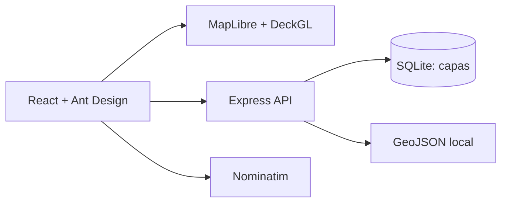

# Arquitectura del visor

## Estructura

| Ruta | Responsabilidad |
| --- | --- |
| `src/main.tsx` | Mapa, panel de capas, búsqueda, selección y controles de vista. |
| `src/types.ts` | Tipos compartidos en el frontend. |
| `src/lib/geojson.ts` | Validación y transformación de coordenadas, separadas de la UI. |
| `src/lib/api.ts` | Peticiones HTTP con tratamiento de errores. |
| `src/style.css` | Diseño del visor y adaptación a pantallas pequeñas. |
| `server/index.js` | API Express, creación de tabla y persistencia SQLite. |
| `public/data/` | Tres datasets GeoJSON de demostración. |
| `.github/workflows/ci.yml` | Compilación automática de cada cambio en GitHub. |

## Flujo de datos

1. El servidor crea la base de datos y carga las tres definiciones de capa si faltan.
2. React pide `GET /api/layers` y carga cada dataset en paralelo mediante `GET /api/layers/:id/data`.
3. El navegador normaliza las coordenadas a EPSG:4326. DeckGL dibuja las capas sobre MapLibre.
4. Los cambios del panel se guardan con `PATCH /api/layers/:id`; el orden se guarda con `PUT /api/layers/order`.

## Próximas ampliaciones

- Sustituir las muestras por los GeoJSON reales del tutor y verificar su CRS y campos.
- Separar el panel, buscador y mapa en componentes conforme crezcan las funcionalidades.
- Si hay varios usuarios, añadir autenticación y espacios de trabajo antes de compartir el servidor.

SQLite se crea en `server/visor.sqlite` al arrancar; está excluida de Git. El mapa base y el geocodificador son servicios externos: pueden requerir sustitución en la red de la empresa.
